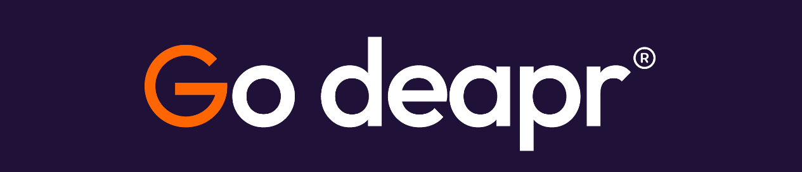
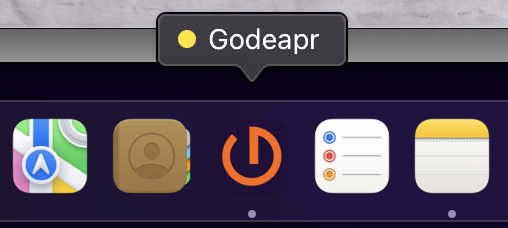
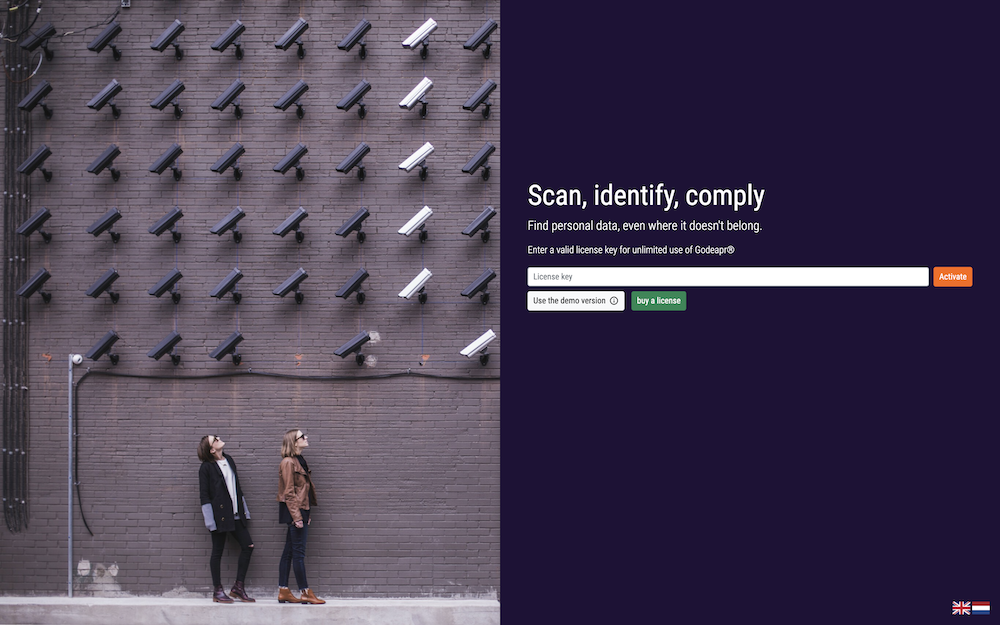
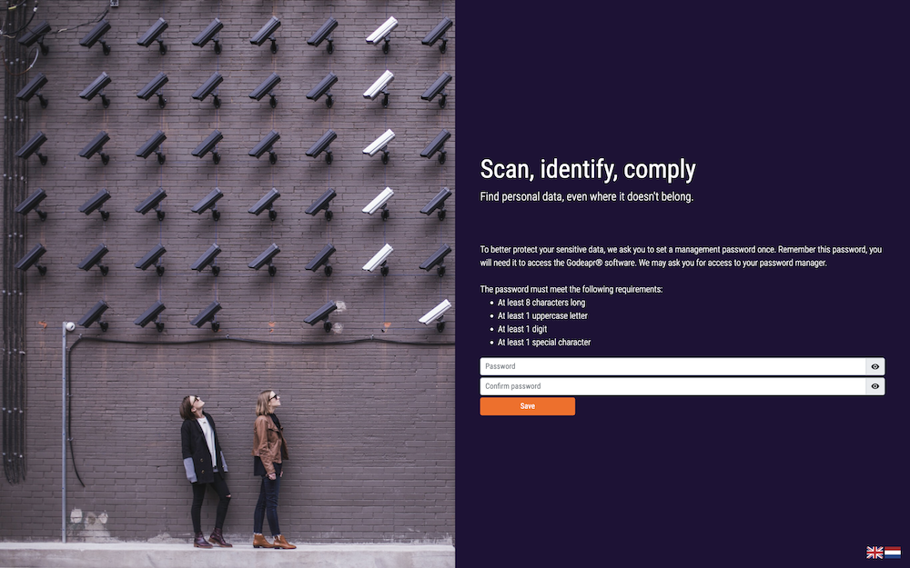
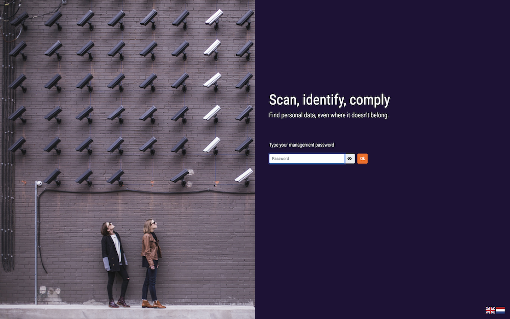
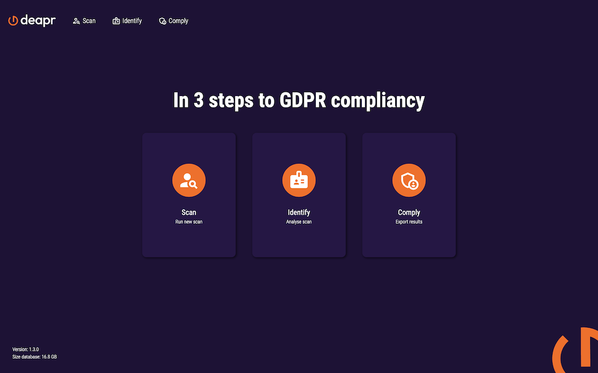
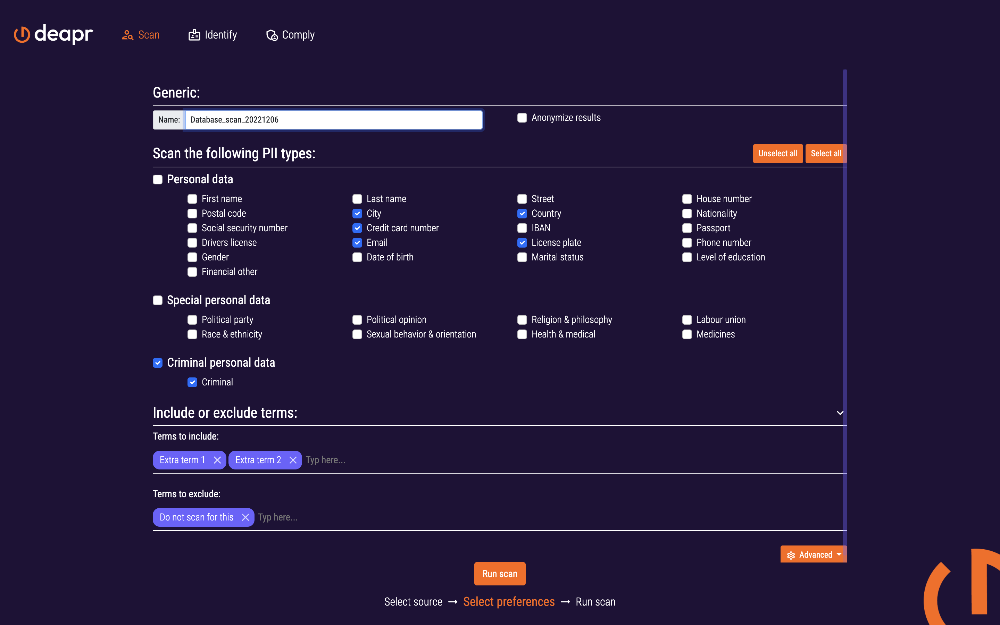
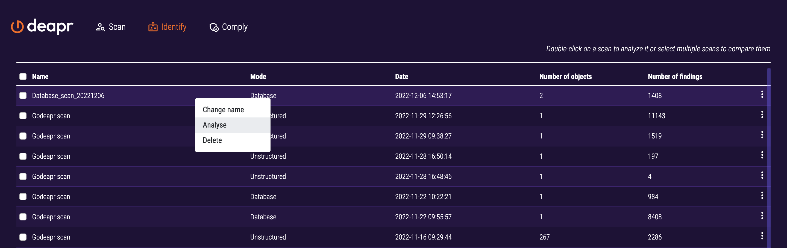
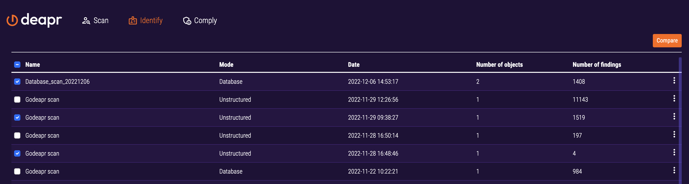
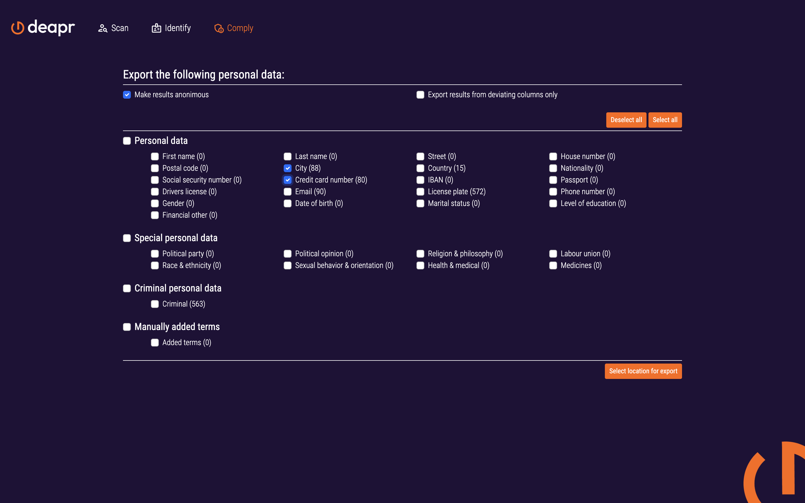

Welcome to the user manual of Godeapr®, the application that finds Personal Identifiable Information (PII) in files, databases, and other sources. This document will explain how the Godeapr® application should be used via a step-by-step approach with clear visuals.

<p style="margin-top: 25px;"></p>

<details>
<summary>Table of Contents</summary>

<p></p>

- [Installation](#installation)
- [Starting the application](#starting-the-application)
  - [First launch](#first-launch)
  - [Successive launches](#successive-launches)
- [Scan](#scan)
  - [Files](#files)
    - [Meta scan](#meta-scan)
  - [Databases](#databases)
    - [Column-mapping](#column-mapping)
    - [Regular vs. Deviating](#regular-vs-deviating)
  - [Preferences](#preferences)
  - [Reports](#reports)
    - [General overview](#general-overview)
    - [Tabular overview](#tabular-overview)
    - [Listed overview](#listed-overview)
  - [APIs](#apis)
- [Identify](#identify)
  - [Loading a previous scan](#loading-a-previous-scan)
  - [Comparing multiple scans](#comparing-multiple-scans)
- [Comply](#comply)
  - [Export](#export)
- [Demo version](#demo-version)
- [Appendix](#appendix)
  - [Personal Identifiable Information](#personal-identifiable-information)
    - [First name](#first-name)
    - [Last name](#last-name)
    - [Street name](#street-name)
    - [House number](#house-number)
    - [Postal Code](#postal-code)
    - [City](#city)
    - [Country](#country)
    - [Nationality](#nationality)
    - [BSN](#bsn)
    - [Credit-card](#credit-card)
    - [IBAN](#iban)
    - [Passport](#passport)
    - [Drivers license](#drivers-license)
    - [Email](#email)
    - [License plate](#license-plate)
    - [Phone number](#phone-number)
    - [Gender](#gender)
    - [Date of birth](#date-of-birth)
    - [Civil status](#civil-status)
    - [Education level](#education-level)
    - [Financial information](#financial-information)
    - [Political party](#political-party)
    - [Political preference](#political-preference)
    - [Religion](#religion)
    - [Labor union](#labor-union)
    - [Ethnicity](#ethnicity)
    - [Sexual preference](#sexual-preference)
    - [Medical information](#medical-information)
    - [Medicines](#medicines)
    - [Criminal convictions and offenses](#criminal-convictions-and-offenses)
</details>

<p style="margin-top: 25px;"></p>

# Installation
Godeapr® can be installed on a Windows, Linux, or Mac machine as a native desktop application or as a command line tool. This user manual focuses on the native desktop application. To install the application find it in the app store of your platform.

# Starting the application
After Godeapr® is installed, you will find the application between your regularly installed apps. To start Godeapr®, double click the icon from the taskbar.

<p align="center">

</p>

## First launch

When launching the application for the first time you will be prompted for a license key. If you don't have a license key you can choose to use to demo version of the application. To read more about the demo version, see [this chapter](#demo-version).

<p align="center">

</p>

After a valid license key is entered or the demo version is activated you're prompted to set a password. This password is needed to unlock to application, to prevent other people to be able to see your sensitive data.
This password has the following requirements:
- At least 8 characters long;
- At least 1 uppercase letter;
- At least 1 digit;
- At least 1 special character

<p align="center">

</p>

## Successive launches

<p align="center">

</p>

After start-up, your will be prompted with a welcoming page. To enter the application, select the deapr logo which will ask you to enter your management password chosen during installation. Without this password you will not be able to enter the application.

<p align="center">

</p>

Once a correct password is given, you will be led to the home page where there are three main actions: 
- **Scan**: start a new scan
- **Identify**: analyze a previous scan
- **Comply**: export results

<p align="center">

</p>

# Scan
When starting a new scan, there are three different source types to connect to:
- Files
- Databases or database exports in xls(x) or csv format
- APIs

## Files
When scanning files on PII, you are able to select specific files or whole folders. This folder can be a local folder on your machine, a mapped network-drive which is used throughout your organization, or locally mapped SharePoint directories for example. You can select multiple directories and files which will all be listed in the view. The following file formats can be scanned:

```
.bmp | .csv | .doc | .docm | .docx | .dot | .eml | .msg | .gif | .htm | .html | .jpe | .jpg | .jpeg | .json | .md | .mht | .log | .odt | .pdf | .plain | .png | .ppxt | .psv | .rtf | .tif  | .tiff | .tsv | .txt | .xlm  | .xls | .xlsx
```

### Meta scan
When satisfied with the file selection, click next to trigger the meta scan. The meta scan scans files on metadata that can be used to filter out files you are not interested in with respect to PII. Reasoning is that some network-drives or SharePoint folders can contain hundreds of thousands of files and by using the meta filters, you will only scan relevant files. 

Filters:
- **Creation date**
- **Last access date**
  - Note that when opening a specific folder containing the folder in a file explorer or even programmatically might already alter the access date.
- **Last modified data**
- **Last Godeapr® scan**
  - Filter based on when the file was last scanned by Godeapr®.
- **Owner**
  - Often the creator of the file.
- **Extension**
- **Size**

Depending on the filter selection, files will be grayed-out, meaning they will not be considered in the scan.

There is also a tab 'not scannable', meaning this file cannot and will not be scanned by our scanning algorithm. A file will be marked as not scannable, when we do not have a suitable way to extract the content of the file to search for potential PII. Examples are executables, temporary files, hidden files, binary files etc.

Godeapr® does not just scan plain text in for example ``` .docx ``` files (word documents), but it also processes images in the document in case there are any. Besides, also attachments found in ```.eml``` files (emails) will be scanned for PII. If there is PII found on e.g. the attachments of the ```.eml``` Godeapr® will indicate that the source is the ```.eml``` for those findings.

<p align="center">

</p>

Proceed to [preferences](https://dev.azure.com/Datamo/Horizon/_wiki/wikis/Horizon.wiki/39/01.-Godeapr-user-manual?anchor=preferences) if you want to follow the next step when scanning a filesystem.

## Databases
When scanning databases on PII, you are able to setup several database connections in Godeapr®. When selecting 'new connection', you will be prompted with a form requesting relevant information for the database you would like to connect to. A 'standard' database connection requires a 
- server
  - the location of the database
- port
  - the entry point on that server
- username
  - the user that has access to the databases and tables you want to scan
  - if want to prevent Godeapr® to scan specific databases or tables, you should restrict this user from doing so
- password
  - the password for the specific user

<p align="center">

</p>

Optionally you can save the password. If you prefer not to, you will be prompted with a request to enter the password manually each time you want to run a scan with that specific database connection. Before saving the connection details, it is wise to test the connection first. Godeapr® will check whether it can reach the database or not. Please note that no firewalls or other network rules should be blocking the request from the location where Godeapr® is installed. 

If the database type you would like to scan, is not listed in this overview, please contact info@deapr.com to check whether we can add the database type to the possible connections.

### Column-mapping
If the database connection is successful, when clicking 'next', Godeapr® extracts the column names from the tables and databases it has access to. Thereafter, you can optionally start a column-mapping activity where column names are mapped to a specific PII which you expect to be in that column. This activity is very useful in determining 'regular' PII versus 'deviating' PII. More information on the difference is explained [here: Regular vs. Deviating](https://dev.azure.com/Datamo/Horizon/_wiki/wikis/Horizon.wiki/39/01.-Godeapr-user-manual?anchor=regular-vs.-deviating).

Each time you change a column-mapping, the change will immediately be saved to the database. Also when you start a new scan with the same database connection, it remembers the mapping you did for a previous scan, so it should be an one-time activity only. If you do not know what kind of PII might be existing in a specific column, you can leave it 'unknown' and Godeapr® will predict the PII type for the column itself. 

<p align="center">

</p>

The rationale is that often database columns have a very specific purpose within a system. One specific column might be used for saving names of customers while other columns just contain a regular timestamp of the creation date of that record. Giving Godeapr® more information on where it should and where it should not find specific PII types, gives you more accurate insights in where PII should not be existing in your database. 

Besides mapping column names to the expected PII types it is possible to skip complete tables or configure a partial scan in this view. When configuring a partial scan you can set a percentage and a maximum number of rows. This will randomly select a percentage of rows from the table untill the maximum is reached. By configuring a partial scan it is possible to do a 'quick scan' of the table.

### Regular vs. Deviating
Godeapr® tries to find PII at 'deviating' locations. It determines whether a found PII type is deviating based on three methods, evaluated in the following order:

1. Based on the column-mapping (more info [here](https://dev.azure.com/Datamo/Horizon/_wiki/wikis/Horizon.wiki/39/01.-Godeapr-user-manual?anchor=column-mapping)). Example: when during the column-mapping stage a particular column is mapped to PII type IBAN, all found IBAN's will be identified as **regular** since we mapped the column to IBAN's. Therefore we also expect to find IBAN's in that particular column. On the other hand, all other PII types found in that column, will be marked as **deviating**. Meaning, we did not expect to find any other PII type in that column besides IBAN's.

2. If there is no PII mapped to a particular column, Godeapr® will estimate a column's PII type based on the name of the column. Often database columns already hint on what the content of the specific column is. For example _ADDR_ hints to _ADDRESS_ and _CC_ hints to _CreditCard_. If Godeapr® was able to estimate a PII type based on the column names, hits for that specific PII type are marked **regular** where all other found PII types will be marked **deviating**.

3. If Godeapr® was not able to determine a PII type based on the column name, it will determine a PII type based on the column data. Where it is determined that if one column is filled with more than 70% of one specific PII type and less than 10% of any other PII type, the column will be mapped to that specific PII type. All findings based on that specific PII type are **regular** and all others are **deviating**. 

If Godeapr® was not able to determine a PII type based on the column data, all found PII types will be marked as **deviating** since there was no reason to believe that those PII types are at a **regular** location, specifically designed to hold that PII.

Note: since the above logic can only be applied on column-based datasets, there is no way to determine **deviating** findings for a scan on unstructured filesystems. 


## Preferences
_This view is similar for scanning files or databases_.

When the setup is satisfactory, clicking next brings you to an overview of all PII types Godeapr® scans for. Which is, in line with the GDPR, categorized in three parts: 
- Personal data
- Special personal data
- Criminal convictions and offenses

For more information on each individual PII, please consult [this chapter](https://dev.azure.com/Datamo/Horizon/_wiki/wikis/Horizon.wiki/39/01.-Godeapr-user-manual?anchor=personal-identifiable-information).

> We **advise** not to scan for thousands of files at once while also scanning for all PII types. This might give overwhelming results and will not help in structurally and accurately identifying PII on unexpected locations. 

<p align="center">

</p>

Besides selecting for specific PII, in this view you can also enter a suitable name for the scan and choose to **anonymize** the results. In the reporting overview, the actual results will be partially masked. This is useful in case PII should be hidden from the user using Godeapr®.

<p align="center">

</p>

Lasty, you can enter extra terms to scan for, like specific terms inside your organisation, and exclude terms that you're not interested in.

## Reports
_This view is similar for scanning files or databases_.

When a scan is started, findings are generated interactively during the process and visualized in a first overview of total findings and deviating findings (see [Regular vs. Deviating](https://dev.azure.com/Datamo/Horizon/_wiki/wikis/Horizon.wiki/39/01.-Godeapr-user-manual?anchor=regular-vs.-deviating)). The progress-bar is based on the number of files or tables yet need to be scanned by Godeapr®. 

<p align="center">

</p>

### General overview
Once the scanning process is finished, you are automatically redirected to the reporting overview which looks more or less as follows:

<p align="center">

</p>

On the left side, there are 3 filtering possibilities:

1.  An checkbox to only visualize the 'deviating' results (see [Regular vs. Deviating](https://dev.azure.com/Datamo/Horizon/_wiki/wikis/Horizon.wiki/39/01.-Godeapr-user-manual?anchor=regular-vs.-deviating)).
2. A selection tree based on PII types. In the example screenshot, you see three PII types selected in the tree: Creditcard, Labor union, and Medical information. Based on this selection, the key-figures table (**5**) and overview graph (**6**) are updated respectively. 
3. A selection tree based on the scanned source. In the screenshot, you see that three tables of the scanned database are selected. So based on total filter selection 

> Hint: use Ctrl (cmd on MacOS) + mouse click to (de)select multiple tree nodes. The dot (**•**) on a tree node indicate that not all children nodes are selected.

On the right of the filters, there is:

4. A tab selection to jump between three different views. A general overview with aggregated results, a tabular overview per data source, or a list overview with detailed information on the specific findings. All views will show the data corresponding to the filter selection.
5. A key-figure table indicating the following data based on the filter selection: 
    - Total scanned sources
    - Total scanned data cells
    - Total scanned columns
    - Total scanned rows
    - Total findings
    - Total deviating findings
6. A graph overview of the total amount of findings and deviating findings per PII type for the filter selection. When a PII type is not selected, the bar will be grayed-out. Hint: If you hover over the bar, a tool-tip will indicate the exact amount of findings and deviating findings for that specific PII type. 
7. An export functionality to export a list of findings according to your filter selection. More information can be found here: [Export](https://dev.azure.com/Datamo/Horizon/_wiki/wikis/Horizon.wiki/39/01.-Godeapr-user-manual?anchor=export).

### Tabular overview
_This view is only visible when scanning for structured data files or databases._

When selecting the table overview (**4**), you will see an overview of findings per scanned source in tabular format. In this view you will see the column names of the scanned sources in the first column and their mapped PII type based on the [Regular vs. Deviating](https://dev.azure.com/Datamo/Horizon/_wiki/wikis/Horizon.wiki/39/01.-Godeapr-user-manual?anchor=regular-vs.-deviating) methods applied in the second column. The superscript per predicted PII type indicates whether the prediction was based on column-mapping, column names, or column data. The remaining three columns indicate the amount of findings per selected PII type in the PII filter on the left side. In this way, the view tells you how much PII is found per column in tabular data and based on which method Godeapr® predicted the PII type.

<p align="center">

</p>

### Listed overview

For more details on the found PII, there is the listed overview. Here, all findings based on the PII type and sources selected in the filters on the left, are visualized in a list. This list provides information about the location of the found PII, the type of the PII and the actual found content. In the below screenshot, there are several PII types found in the same piece of data; BSN, IBAN, Political Party, Religion. In the 'found data' column is highlighted in purple what the specific PII type was that Godeapr® found. If there is nothing highlighted, it means that the text as a whole was the PII on which Godeapr® was triggered, like you see with the email 'van-den-veldeeline@hotmail.com'.

The red (**!**) indicated that the PII was found on a **deviating** location (_structured data only_). More information here: [Regular vs. Deviating](https://dev.azure.com/Datamo/Horizon/_wiki/wikis/Horizon.wiki/39/01.-Godeapr-user-manual?anchor=regular-vs.-deviating). For scans on unstructured data and files, this explanation mark will not be visible. 

<p align="center">

</p>

When you click one of the rows in the list, you see the source of the specific PII and the row where exactly the data is found. For unstructured scans, the row is an estimation as many unstructured documents like PDF files or images do not have a defined length nor rows. 

When indicated to make the results **anonymized** in the [preferences](https://dev.azure.com/Datamo/Horizon/_wiki/wikis/Horizon.wiki/39/01.-Godeapr-user-manual?anchor=preferences) section. All found data will be partially masked to hide the PII from the user as you can see below. 

<p align="center">

</p>

## APIs
When you want to scan data coming from an API, the client needs to be installed in the back-end to be able to call the endpoint and extract data. Currently, there are no standard APIs included in the application. To add your own API, please contact info@deapr.com.


# Identify
Once scans are completed and you would like to analyze the results once more, you can do so in the **Identify** section. Here all previous scans are listed, including their given name, the mode and the run date of the scan, how many source objects Godeapr® scanned and how much PII was found in those objects. 

## Loading a previous scan
When right-clicking on a scan a context menu is shown with options to delete, analyse or re-run the scan or to change its name. There are three options to analyse the scan:
- Double click on it;
- Select it and then press 'Analyze' in the top right corner;
- Open the context menu by right clicking and then choose analyze

<p align="center">

</p>

Analyzing an previous scan will load the scan and bring you to the [reporting overview](https://dev.azure.com/Datamo/Horizon/_wiki/wikis/Horizon.wiki/39/01.-Godeapr-user-manual?anchor=reports).

## Comparing multiple scans
Besides loading a single scan, you can also compare multiple scans to see if any progress was made during an optional clean-up process within your organization. To compare multiple scans, simply select multiple scans in the list and the analyze button in the top right corner changes to **Compare**. Needless to say, it is wise to compare scans that make sense to compare. For example when the scan was executed to the same source objects with the same PII types included. 

> Note: It is possible to include as many scans as necessary in the comparison, but all scans need to have at least one finding and should be of the same mode. Meaning you should compare database scans with database scans and unstructured file system scans with unstructured file system scans. 

<p align="center">

</p>

When starting a comparison, all scans will be loaded and you will automatically be led to a comparison report like the one below. The scans are automatically ordered by their execution date throughout the report. The first table shows the amount of deviating results in case you are comparing either database scans or structured filesystem scans. The number of deviating findings is displayed in this table as well as the relative deviating findings based on the total number of findings for all scans for each group of PII types. The filters on the left are again available for quick and easy navigation through the scanned objects and PII types. 

<p align="center" style="margin-bottom: 0px;">

</p>
<p align="center">

</p>


The graph is only showing the relative deviating findings per group of PII types per scan. In this way you quickly see the progress when reducing and cleaning the number of unwanted deviating findings.

When comparing unstructured scans, only the last table and a corresponding graph as visualized. This last table shows the total number of findings and the relative number of findings based on the total. Godeapr® does not show deviating findings for unstructured scans, more information can be found here: [Regular vs. Deviating](https://dev.azure.com/Datamo/Horizon/_wiki/wikis/Horizon.wiki/39/01.-Godeapr-user-manual?anchor=regular-vs.-deviating).

# Comply

To quickly comply and start addressing potential issues, in the **Comply** section, you find a similar list of processes as in the **Identify** section. Instead of loading the process in the reporting overview or comparing the reports, here it is possible to export particular findings to support or facilitate addressing issues conveniently. 

## Export
When selecting the 'download' icon, you will be prompted with a couple of choice regarding the export:
- Whether or not to export only deviating results
- To anonymize the results in the export, which is on by default
- To export findings from specific PII types

<p align="center">

</p>

The next step will be to select an export location on the machine where Godeapr® is installed. Hereafter, a ```.csv``` file will be generated including the:
- Name of the source
- Column index (_structured data only_)
- Row index (_estimation for unstructured data_)
- Location of the source (_file path or database / table name_)
- Whether the PII was found at a deviating location (_structured data only_)
- the PII type
- the original data (_non anonymized exports only_)
- the matched data (_non anonymized exports only_)

# Demo version

When the application is running without a valid license, it is limited in the following ways:

- Only 5 scans can be done and removing scans is not possible;
- The scans can include all PII types but only first names, social security numbers and emails can be listed and exported;
- The export functionality only exports 100 (randomly selected) findings

# Appendix
## Personal Identifiable Information 
### First name
### Last name
### Street name
### House number
### Postal Code
### City
### Country 
### Nationality
### BSN
### Credit-card
### IBAN
### Passport
### Drivers license
### Email
### License plate
### Phone number
### Gender
### Date of birth
### Civil status
### Education level
### Financial information
### Political party
### Political preference
### Religion
### Labor union
### Ethnicity
### Sexual preference 
### Medical information
### Medicines 
### Criminal convictions and offenses
